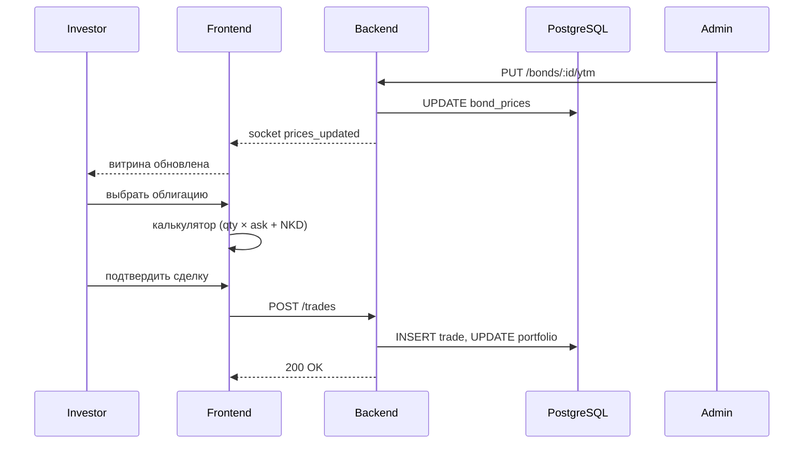

# OTC Market Portal — MVP Plan

**Обзор:** MVP портала внебиржевой торговли ГЦБ: витрина облигаций с расчётом YTM/НКД, калькулятор сделок, исполнение buy/sell, реестры — без внешних интеграций (auth через JWT login/password).

## Чеклист реализации

- [x] Инициализировать npm workspace: корневой package.json, client (Vite+React+TS), server (Express+TS), docker-compose для PostgreSQL (опционально)
- [x] SQL-схема (migrations): users, bonds, bond_prices, trades, portfolio + seed-данные
- [x] `pricing.ts`: расчёт P_clean (YTM-дисконтирование), НКД, P_dirty, Ask/Bid
- [x] Auth: POST /login, JWT middleware, bcrypt-хеширование паролей
- [x] CRUD для облигаций + PUT /bonds/:id/ytm → пересчёт bond_prices + socket broadcast
- [x] POST /trades: валидация, создание сделки, обновление portfolio, расчёт broker_margin
- [x] GET /portfolio, GET /trades, GET /reports/margin (admin)
- [x] LoginPage + axios-интерсептор для JWT + zustand auth store + ProtectedRoute
- [x] MarketPage: таблица облигаций (Ask/Bid/YTM) + socket.io + DealModal (калькулятор)
- [x] PortfolioPage, TradesPage, AdminPage (+ реестр остатков, сводка для админа)

## Структура проекта

```
gov_broker_app/
├── client/          # React 18 + TypeScript + Vite + Tailwind
├── server/          # Express + TypeScript + Socket.io
├── docker-compose.yml
└── package.json     # корневой workspace (npm workspaces)
```

## Роли

- **admin** (Госброкер): управляет параметрами облигаций, вводит дневной YTM, видит back-office
- **investor**: видит витрину, калькулятор, совершает сделки, видит свой портфель

## База данных (PostgreSQL)

**Таблицы:**

- `users` — id, email, password_hash, role (admin/investor), full_name, created_at
- `bonds` — id, isin, name, nominal, coupon_rate, issue_date, maturity_date, coupon_frequency (раз/год), status
- `bond_prices` — id, bond_id, date, ytm, clean_price, dirty_price, ask_price, bid_price (пересчёт при вводе YTM)
- `trades` — id, user_id, bond_id, trade_type (buy/sell), quantity, price_per_bond, nkd_per_bond, total_amount, broker_margin, status (pending/completed), created_at
- `portfolio` — id, user_id, bond_id, quantity, avg_price (обновляется триггером/сервисом)

## Ценообразование (`server/src/services/pricing.ts`)

```
P_clean = Σ C/(1+r)^t + M/(1+r)^n
NKD     = C × (days_since_coupon / days_in_period)
P_dirty = P_clean + NKD
Ask     = P_dirty × 1.025
Bid     = P_dirty × 0.975
broker_margin_per_trade = quantity × P_dirty × 0.05
```

## Backend API (`server/src/`)

**Routes:**

- `POST /api/auth/login` — возврат JWT
- `GET  /api/bonds` — витрина (цены последнего дня)
- `POST /api/bonds` (admin) — создать облигацию
- `PUT  /api/bonds/:id/ytm` (admin) — обновить YTM → пересчёт цен → `socket.emit('prices_updated')`
- `POST /api/trades` (investor) — создать сделку → обновить portfolio
- `GET  /api/trades` — журнал (admin = все, investor = свои)
- `GET  /api/portfolio` (investor) — портфель
- `GET  /api/reports/margin` (admin) — ведомость маржи

**Socket.io:** при каждом обновлении YTM сервер рассылает новые цены всем клиентам — витрина обновляется в реальном времени.

## Frontend страницы (`client/src/pages/`)

- `LoginPage` — форма email/password
- `MarketPage` — таблица облигаций: ISIN, купон, срок, Ask/Bid, доходность; кнопка «Купить/Продать» → открывает калькулятор
- `DealModal` — калькулятор: ввод количества → показ цены, НКД, итоговой суммы → кнопка подтверждения
- `PortfolioPage` (investor) — позиции, средняя цена, текущая стоимость
- `TradesPage` — журнал сделок
- `AdminPage` — управление облигациями + ввод YTM + отчёт по марже

## Поток операции



## Ключевые зависимости

**server:** express, pg, jsonwebtoken, bcryptjs, socket.io, zod, dayjs  
**client:** react, react-router-dom, axios, socket.io-client, zustand, tailwindcss, @tanstack/react-table, recharts
